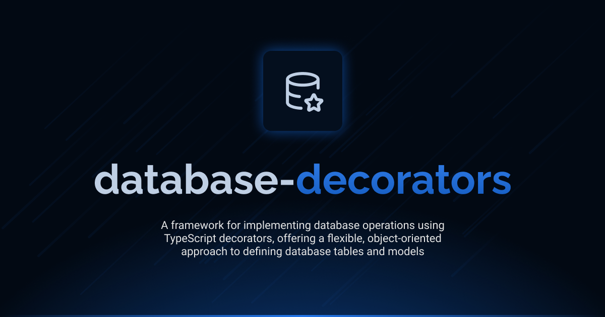

# Interface Database Decorators

[](LICENSE.md)
[](https://github.com/antelopejs/antelope)

A structured framework for implementing database operations using TypeScript decorators. Interface Database Decorators offers a flexible, object-oriented approach to defining database tables, models, and operations with full type safety.

## Installation

```bash
ajs module imports add database-decorators@beta
```

## Documentation

Detailed documentation is available in the `docs` directory:

- [Introduction](./docs/1.introduction.md) - Overview and basic concepts
- [Table Definitions](./docs/2.table-definitions.md) - Defining database tables with decorators
- [Table Modifiers](./docs/3.table-modifiers.md) - Table modifiers for encryption, hashing, and localization
- [Data Models](./docs/4.data-models.md) - Creating and using data models
- [Parameter Decoration](./docs/5.parameter-decoration.md) - Parameter decorators for API controllers

## Current Status

This is the development version (`beta`) of the Interface Database Decorators. It is currently in pre-release stage and may undergo changes before the final release. The interface is not considered stable for production use without understanding that breaking changes may occur.

## Versions

| Version | Link                                                                                                                              | Status                                        |
| ------- | --------------------------------------------------------------------------------------------------------------------------------- | --------------------------------------------- |
| beta    | [database-decorators@beta](https://github.com/AntelopeJS/database-decorators/tree/main/.antelope/output/database-decorators/beta) | Waiting validation from community to go in v1 |
| 1       | _Not yet released_                                                                                                                | Planned stable release                        |

## License

This project is licensed under the Apache License 2.0 - see the [LICENSE.md](LICENSE.md) file for details.
